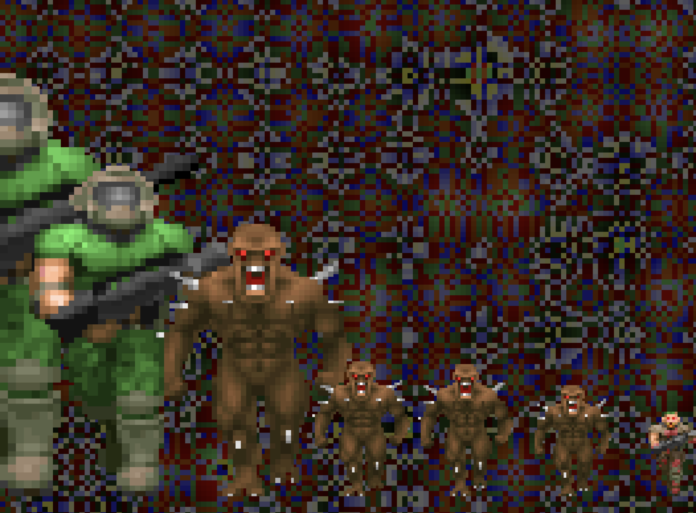
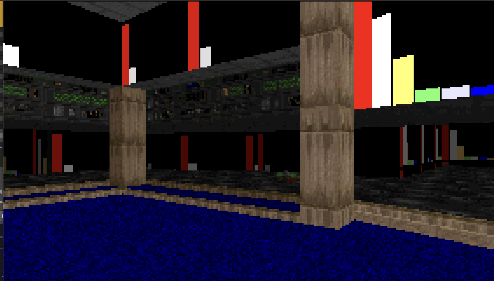
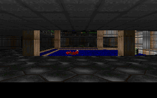

# DoomViz

A spectral music-visualization framework that drives the Doom (1994) software renderer from real-time audio. Drop it on a track in any VST3 or AU host; eight user-defined spectral bands feed a growing list of Doom-engine visualization presets.

Built on stripped [linuxdoom-1.10](https://github.com/id-Software/DOOM), [JUCE](https://juce.com/), and [yaml-cpp](https://github.com/jbeder/yaml-cpp).

## Screenshots

| Doom Spectrum | Analyzer | Kill Room |
|---|---|---|
|  |  |  |

A live VRT baseline gallery is published on every push to main: [doom-vst Pages → /vrt/](https://2600hz-oscillator.github.io/doom-vst/vrt/).

## The framework

The plugin is shaped around one shared abstraction: **eight spectral bands**, each defined by:

- **Low Hz** / **High Hz** — the band's frequency range, sampled directly from the FFT magnitude spectrum (bands may overlap, leave gaps, or be re-ordered)
- **Gain** — a 0..1 attenuation applied to the band's amplitude
- **Sprite** — a Doom sprite ID drawn from the shareware WAD's catalog (Characters / Guns / Powerups / Armor)

These eight band rows live in the **GLOBAL** section of the control window and are shared across every preset. Edits stage in the UI; **Apply** commits them to the live renderer, **Revert** discards. Configuration **persists as runtime state**:

- across MIDI Program Change scene switches (no reset, no flash, no map reload)
- across plugin window opens and closes
- through DAW project save / restore (full XML round-trip)

Beneath the band rows, the control window swaps in a per-preset section that exposes whatever extra knobs the active preset needs. That state persists too.

## Visualization presets

Three live presets today, switched via the floating control window or MIDI Program Change (PC 0/1/2). The framework is set up to add more without touching the shared band model — each preset is a single C++ class that subscribes to the band amplitudes and renders into the same 320×200 indexed framebuffer.

### PC 0 — Kill Room
Auto-walks E1M1 with the shotgun. Each band fires its **assigned sprite** as a Doom mobj when the band's envelope crosses a rising-edge threshold (with hysteresis + per-band cooldown). Characters spawn as monsters, powerups and armor spawn as pickups, gun sprites are skipped. Sector lighting pulses with overall RMS. God mode, infinite ammo, monsters non-solid.

### PC 1 — Analyzer
Auto-walks E1M1 with the BFG9000. The 8 user-configured bands are injected as colored bars onto the `STARTAN3` wall texture in real time — bar palette stays the existing Doom-status-bar colors. Player movement speed tracks band 1 (sub-bass).

### PC 2 — Doom Spectrum
2D mode. An audio-driven background renders behind eight Doom sprites (one per band) whose size scales with `bandAmplitude × (gain × 4.0)`. The background is selectable via a **Background Vibe** dropdown:

- **ACIDWARP.EXE** — layered sin/cos warp; per-band envelopes drive zoom, swirl rate, color shift, intensity. Onsets jolt the palette.
- **VAPORWAVE** — scrolling vertical bars in purple / teal / pink with a vertical gradient. Bar width tracks band 3; color phase tracks band 4.
- **PUNKROCK** — grid of brown / black / gray squares. Cell size tracks band 3; cells jitter with overall RMS.
- **DOOMTEX** — tiles a real E1M1 wall texture (`STARTAN3`, `BROWN1`, `COMPSTA1`, `COMPUTE1`, `TEKWALL1`, `BROWNHUG`, `BIGDOOR2`, `METAL`). Pick a starting texture from the dropdown; toggle **AUTO** to cycle on each rising-edge band crossing, with a configurable BAND selector (1..8) and THRESH slider.
- **WINAMP** — eight stacked-LED EQ bars, green → yellow → red, with white peak-hold markers that decay slowly.
- **STARFIELD** — Win95-screensaver-style zooming starfield; speed scales with overall RMS, near stars sparkle.
- **CRTGLITCH** — CRT scanlines and horizontal tear bands with chromatic aberration; onsets trigger flashes.

## How it works

```
Audio In ─→ FFT / RMS / Onset ─→ BandAnalyzer ─┐
                                                ├─→ Active preset ─→ Doom renderer ─→ OpenGL texture
MIDI In  ─→ Note / CC / PC ────→ SignalRouter ─┘                          │
                                       ↑                                   │
                                  YAML config                          Plugin window
```

`BandAnalyzer` is the shared helper every preset uses to slice the FFT spectrum into the user's 8 Hz-defined bands and run a per-band one-pole envelope follower (10 ms attack, 150 ms release). All three presets read amplitudes from the same code path, so spectral analysis is consistent everywhere.

Audio passes through unchanged. The plugin is purely visual.

### Audio analysis

- **FFT** — 2048-sample Hann window, magnitude spectrum sliced into the user's 8 bands at frame time
- **RMS** — time-domain, with envelope follower
- **Onsets** — spectral flux transient detection
- **MIDI** — note velocity, 128 CCs, program change, MIDI clock

The audio thread → render thread handoff is lock-free (`juce::AbstractFifo` ring buffer + atomic MIDI state).

### YAML routing (optional)

Configs in `config/` map analyzer outputs to scene parameters. Without a config, sane audio defaults are auto-wired. The 8 user bands are independent of YAML routing — they're a separate, always-on path.

```yaml
inputs:
  kick_env:
    source: audio
    mode: band_rms
    band: [20, 200]
    smoothing: 0.05
    gain: 2.0
routes:
  - from: kick_env
    to: sector_light.all
    scale: 1.0
```

## Install

### macOS (no build)
A prebuilt arm64 VST3 is committed under `dist/DoomViz.vst3` (binary tracked via git-lfs), signed with an Apple Developer ID and notarized + stapled, so it loads in any DAW without Gatekeeper warnings or `xattr -cr` workarounds.

```bash
cp -R dist/DoomViz.vst3 ~/Library/Audio/Plug-Ins/VST3/
```

Then rescan plugins in your DAW.

### Linux (tagged release)
Download the `DoomViz-vX.Y.Z-linux-x86_64.tar.gz` artifact from the latest [GitHub Release](https://github.com/2600hz-oscillator/doom-vst/releases) and extract into `~/.vst3/` (per-user) or `/usr/lib/vst3/` (system-wide).

### Windows
In flight. CI build job in place; tag-triggered release publishing pending.

## Building

macOS and Linux builds run inside [Flox](https://flox.dev/), which manages cmake / ninja / git-lfs / python deps. Windows uses native VS 2022 (no flox there). Host requirements:

- **macOS** — Apple Clang via Xcode Command Line Tools (`xcode-select --install`)
- **Linux** — flox handles everything
- **Windows** — Visual Studio 2022 Build Tools + Git Bash (for the Taskfile)

Build via [Task](https://taskfile.dev/), installed by flox on Unix or available standalone on Windows:

```bash
git clone --recursive <repo>
cd doom_viz

# macOS / Linux
flox activate
task build         # current platform
task install-mac   # macOS only: installs the VST3 system-wide
task test          # full test suite
task vrt           # visual regression suite (macOS only — baselines are platform-pinned)
task --list

# Windows (Git Bash)
task build-win
task test-win
task install-win
```

`DOOM1.WAD` (shareware) is auto-bundled into the plugin during build.

### Cross-platform Linux from macOS
`task build-linux` runs natively on Linux. From macOS, use the flox container path:

```bash
flox containerize | docker load
docker run --rm -v $(pwd):/work -w /work flox-doomviz task build-linux
```

## Adding a new preset

Each preset is a `Scene` subclass under `src/scenes/`. The minimal footprint:

1. Implement `init(DoomEngine&)` (transient/animation reset only — config lives in `VisualizerState`)
2. Implement `update(DoomEngine&, ParameterMap, float dt)` — call `bandEnv.update(analyzer, vizState.getGlobal(), dt)` and consume `bandEnv[i]`
3. Implement `render(DoomEngine&)` returning the 320×200 RGBA buffer
4. Register in `DoomViewport::newOpenGLContextCreated()` and `test/vrt/vrt_runner.cpp`

If the preset needs persistent per-scene state (vibe, picker selection, thresholds), add fields to a new sub-struct in `src/patch/VisualizerState.h` and a new `*Section` widget under `src/patch/`.

## Project layout

```
libs/doom_renderer/      stripped linuxdoom-1.10 as a static C library
src/
  PluginProcessor.*      JUCE AudioProcessor (pass-through + MIDI)
  PluginEditor.*         editor window
  DoomViewport.*         OpenGL viewport: texture upload, aspect scaling
  ControlWindow.*        single floating control window (global + per-preset sections)
  audio/
    SignalBus.*          lock-free audio + MIDI handoff
    AudioAnalyzer.*      raw FFT magnitudes + RMS + onsets
    BandAnalyzer.*       FFT bins → user's 8 bands + per-band envelope (shared)
    MidiHandler.*        MIDI parsing
  routing/               YAML SignalRouter + RouteConfig (optional)
  scenes/                Scene base + KillRoom, AnalyzerRoom, Spectrum2 (more welcome)
  patch/
    VisualizerState.*    persistent state (GlobalConfig + per-scene configs, SpinLock-protected)
    BandRowsSection.*    GLOBAL band-row UI
    SpectrumSection.*    per-preset Spectrum UI (vibe, DOOMTEX picker)
    PlaceholderSection.* per-preset placeholder for KillRoom / Analyzer
    SpriteCatalog.*      every sprite present in the shareware WAD
  doom/                  C++ wrapper around the C renderer
config/                  default YAML configs
test/                    render harness, Catch2 unit + integration tests, VRT runner + baselines
extern/                  JUCE, yaml-cpp, Catch2 submodules
```

## Doom renderer extensions

The C renderer was extended with:

- `doom_move_player` — collision-checked movement via `P_TryMove`
- `doom_set_camera_angle` — rotate without relinking the blockmap
- `doom_set_wall_texture_data` — replace a wall texture's column data at runtime
- `doom_set_flat_data` — replace a floor / ceiling flat
- `doom_get_sprite` — pull raw `patch_t` data for sprite drawing
- `doom_fire_weapon` / `doom_give_weapon` — weapon control
- `doom_set_god_mode` / `doom_respawn_player` — player state

## License

Doom source is GPL. `DOOM1.WAD` (shareware) is freely redistributable per id Software's terms. This project is open source and noncommercial.
