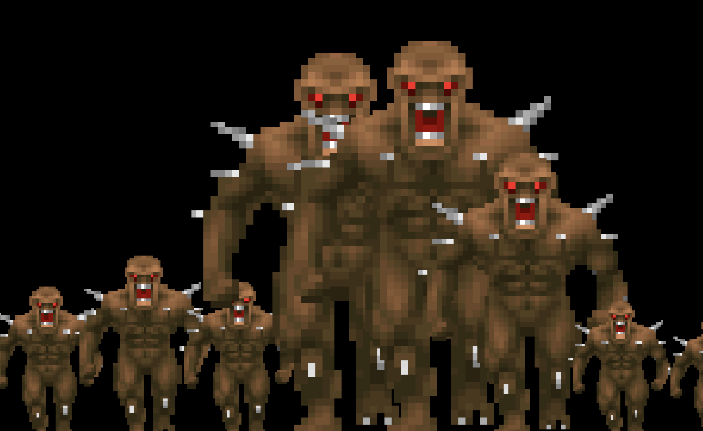
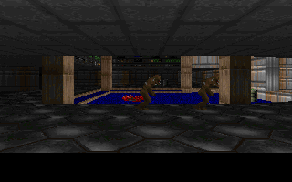

# DoomViz

A VST3/AU music visualizer plugin that embeds the Doom (1994) software renderer and drives it from real-time audio and MIDI input. Load it as an effect in your DAW, route audio through it, and watch E1M1 come alive with your music.

Built on the stripped [linuxdoom-1.10](https://github.com/id-Software/DOOM) renderer, [JUCE](https://juce.com/) for the plugin framework, and [yaml-cpp](https://github.com/jbeder/yaml-cpp) for configuration.

## Screenshots

| Analyzer Scene | Sprite Spectrum | Kill Room |
|---|---|---|
|  |  |  |

## How It Works

Audio flows through the plugin unchanged while a parallel analysis pipeline extracts:
- **FFT spectrum** (2048-sample, 16 log-spaced frequency bands from 20Hz to 20kHz)
- **Time-domain RMS** level with envelope follower
- **Onset detection** via spectral flux
- **MIDI state** (note velocity, CC values, program change, clock)

A YAML routing engine maps these signals to visual parameters. Three scenes read the parameter map each frame to drive the Doom renderer in different ways.

```
Audio In -> FFT/RMS/Onset -> Signal Router -> Scene Controller -> Doom Renderer -> OpenGL Texture
MIDI In  -> Note/CC/PC    ->      ^                                                     |
                              YAML Config                                          Plugin Window
```

## Visualizer Scenes

### Kill Room (Scene A — default)
Auto-navigates E1M1 with collision-checked movement. Audio onsets spawn monsters (imps, zombiemen, shotgun guys) directly ahead of the player. When monsters are nearby and audio is playing, the player faces them and fires the shotgun. Sector lighting pulses with RMS level. Camera speed increases with audio energy. Player has god mode and infinite ammo. Monsters are non-solid so the player walks through them.

### Sprite Spectrum (Scene B)
A 2D visualizer that decodes actual Doom imp sprites from the WAD's patch data and draws them scaled by frequency band amplitude. 8 bands from sub-bass to air, each represented by a real imp sprite ranging from 0.5x scale at silence to 3x at full amplitude. Dark background with Doom palette colors.

### Analyzer Room (Scene C)
Walks through E1M1 holding the BFG9000 while an 8-band FFT spectrum is injected onto the STARTAN3 wall texture in real-time. Each band has a distinct color (red, orange, yellow, green, cyan, blue, purple, magenta). Movement speed is driven by the sub-bass (red) band — bass hits make you move, silence keeps you still. Collision-checked navigation with wall avoidance.

Switch scenes via the floating control window or MIDI Program Change (0/1/2).

### Scene Isolation
Each scene switch fully reloads the E1M1 map, resetting all engine state (monsters, textures, sectors, weapons). No state bleeds between scenes.

## E1M1 Test Renders

Deterministic baseline renders from the test suite:

| E1M1 Starting View | E1M1 With Spawned Imps |
|---|---|
|  |  |

## Building

### Prerequisites

- macOS with Apple Clang (Xcode Command Line Tools)
- [Flox](https://flox.dev/) for dependency management
- DOOM1.WAD (shareware) in `resources/`

### Build Steps

```bash
# Clone with submodules
git clone --recursive <repo-url>
cd doom_viz

# Activate the flox environment (provides cmake, git-lfs, python3)
flox activate

# Configure (must use Apple Clang for JUCE Objective-C++ support)
mkdir -p build && cd build
cmake .. -DCMAKE_C_COMPILER=/usr/bin/clang -DCMAKE_CXX_COMPILER=/usr/bin/clang++
cd ..

# Build standalone app
flox activate -- cmake --build build -j1 --target DoomViz_Standalone

# Build VST3 plugin
flox activate -- cmake --build build -j1 --target DoomViz_VST3

# Install VST3
cp -R build/DoomViz_artefacts/VST3/DoomViz.vst3 ~/Library/Audio/Plug-Ins/VST3/
codesign --force --deep --sign - ~/Library/Audio/Plug-Ins/VST3/DoomViz.vst3
```

The DOOM1.WAD is automatically bundled into the plugin's Resources during build.

### Run Tests

```bash
flox activate -- bash -c 'cd build && ctest --output-on-failure'
```

## Usage in a DAW

1. Build and install the VST3 (see above)
2. Add DoomViz as an effect on an audio track
3. Route audio through the track — audio passes through unchanged
4. The plugin window shows the Doom renderer reacting to your audio
5. A floating "DoomViz Controls" window appears for scene switching
6. Or send MIDI Program Change 0/1/2 to switch scenes

### YAML Configuration

Scene routing is configured via YAML files in `config/`. The default config maps:
- Low frequency band RMS (20-200Hz) to sector lighting
- Audio onsets to monster spawning
- Overall RMS to camera shake and player speed
- MIDI velocity to lighting boost
- MIDI CC1 to palette flash

See `config/default_killroom.yaml` for the full schema.

## Architecture

```
doom_viz/
  libs/doom_renderer/     # Stripped linuxdoom-1.10 as a static C library
  src/
    PluginProcessor.*     # JUCE AudioProcessor (audio pass-through + analysis)
    PluginEditor.*        # JUCE editor window
    DoomViewport.*        # OpenGL renderer (texture upload + aspect scaling)
    ControlWindow.*       # Floating control panel (separate OS window)
    audio/                # SignalBus, AudioAnalyzer, MidiHandler
    routing/              # YAML-driven SignalRouter + RouteConfig
    scenes/               # Scene interface + KillRoom, SpriteSpectrum, AnalyzerRoom
    doom/                 # DoomEngine C++ wrapper
  config/                 # YAML scene configs
  test/                   # Render test harness + baselines + test audio
  extern/                 # JUCE and yaml-cpp submodules
```

### Key APIs Added to Doom Renderer

- `doom_move_player()` — collision-checked movement via P_TryMove
- `doom_set_camera_angle()` — angle-only update without blockmap relinking
- `doom_set_wall_texture_data()` — inject custom pixel data onto wall textures
- `doom_fire_weapon()` / `doom_give_weapon()` — weapon control
- `doom_set_god_mode()` / `doom_respawn_player()` — invulnerability

## License

The Doom source code is released under the [GPL](https://github.com/id-Software/DOOM/blob/master/linuxdoom-1.10/DOOMLIC.TXT). DOOM1.WAD (shareware) is freely redistributable per id Software's original terms. This project is open source and noncommercial.
